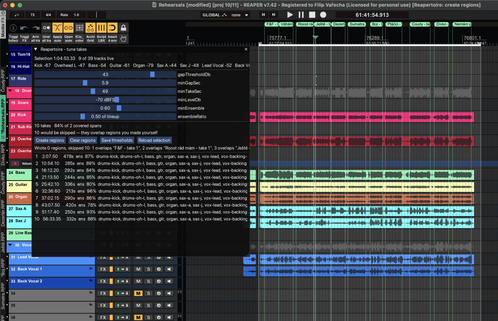
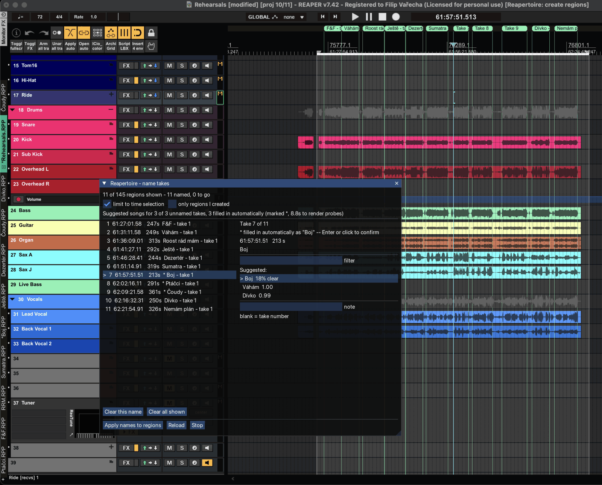
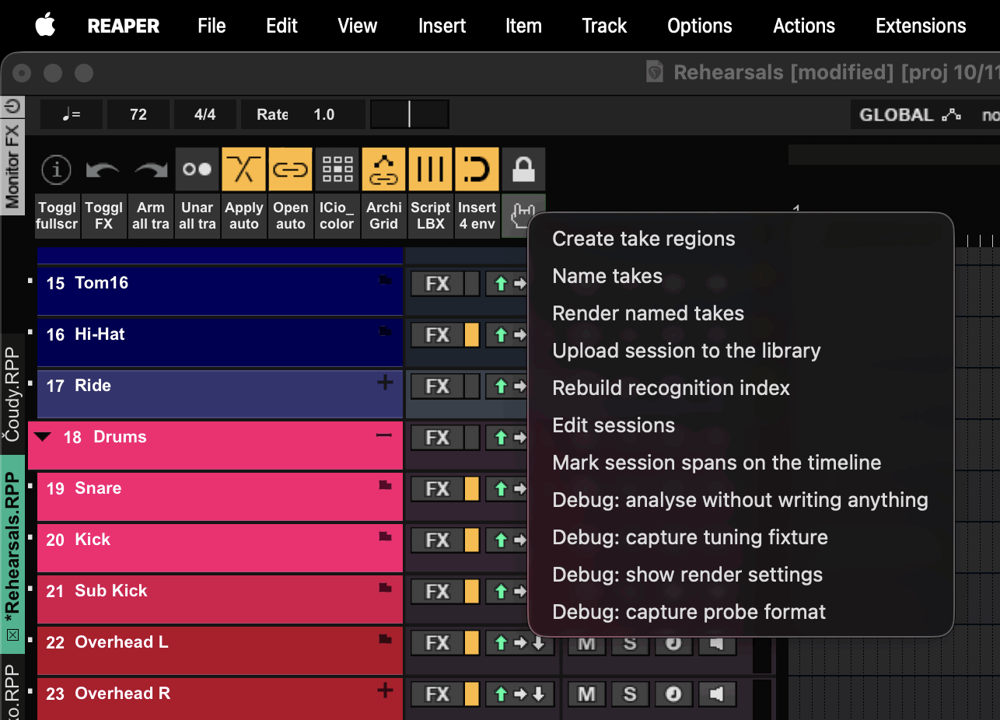

# Reapertoire

**Finds, names and renders takes from multitrack rehearsal recordings in
REAPER.**



Recording a band rehearsal is easy. What is tedious is everything afterwards:
finding where each run-through starts and stops in an hour of continuous audio,
working out which song it was, marking it, and rendering it. Reapertoire does
the finding, reduces the naming to a couple of keystrokes per take, and renders
the results with the metadata a library needs.

It assumes nothing about your lineup. Any instrument may be absent from any
session, including drums, and nothing depends on a particular reference track
existing.

An hour of continuous recording becomes a folder of named takes, each with a
master, per-instrument stems, waveforms and a manifest — in a few minutes,
most of which is REAPER rendering. From there `tools/ingest/upload.py` pushes
the session to [**bandplate**](https://github.com/bandplate/bandplate), a
self-hosted archive where the band can browse, play and vote on what it
recorded. That upload is optional: the rendered folder is a complete,
self-describing artifact on its own.

## Requirements

- REAPER 7 (developed against 7.42, macOS)
- [ReaImGui](https://github.com/cfillion/reaimgui) for the panels
- Lua 5.4 to run the tests — `brew install lua@5.4`
- Python 3.12 and `ffmpeg`, for song recognition only

## Install

Symlink the checkout into REAPER's scripts directory:

```sh
ln -s /path/to/reapertoire ~/Library/Application\ Support/REAPER/Scripts/Reapertoire
```

Load `scripts/Reapertoire.lua` from the action list and put it on a toolbar.
That one action is the entry point; it opens a menu of the tools, so nothing
else needs registering.

Then copy the example configuration and edit it:

```sh
cp config/settings.example.json config/settings.json
```

It holds your output path, the detection thresholds, the mapping from REAPER
track names to instrument slugs, and your song list. It is gitignored, so your
repertoire and lineup stay out of the repository.

Song recognition needs its own environment:

```sh
./bin/setup-recognise
```

## Workflow

1. **Create take regions.** Make a time selection over a rehearsal.
   The panel detects takes, shows them live as you drag the thresholds, and
   writes regions when you are happy.
2. **Name takes.** Takes the recogniser is confident about arrive already named.
   For the rest: arrow between takes — each seeks and plays — type one or two
   letters to filter your songs, press Enter to accept and jump to the next
   unnamed one.
3. **Render named takes.** Produces a master, per-instrument stems, and a
   waveform for each of them, plus a manifest.
4. **Rebuild recognition index.** Feeds the takes you just named back in,
   so the next session arrives with suggestions. See below.



Two more sit in the launcher alongside those. **Edit sessions** corrects a
rehearsal's date, label, kind, venue and notes, and deletes a session record --
the record only; rendered audio is never touched. **Mark session spans on the
timeline** writes a pair of markers around each rehearsal, so a project holding
a year of them shows where one stops and the next begins. Markers rather than
regions: the region lane already carries one per take.

The four **Debug:** entries are for working on Reapertoire itself, not for
running a rehearsal.



### Keyboard

Only the naming panel is driven from the keyboard, and it is built so the hands
never leave the filter box: arrow keys are read wherever focus is, and the box
takes focus again after every accepted name.

| Key | What it does |
|---|---|
| `↑` `↓` | Move between takes. Each move seeks the edit cursor to the take and starts playback if it is stopped, so you hear what you are naming. Clears whatever you had typed. |
| letters | Filter your songs. Diacritic- and case-insensitive both ways, so `ptacci` finds `Ptáčci` and `PTÁČCI` finds it too. |
| `Enter` | Accept the top entry, then jump to the next take that still has no song, seek and play it, and put the cursor back in the filter box. Numeric-keypad Enter works the same. |
| click | Clicking a take in the list selects it and plays it; clicking a song in the suggestion list names the take without moving on. |

`Enter` is the whole workflow: type one or two letters, press it, repeat.

What `Enter` accepts depends on what is on screen. With something typed it takes
the top filtered song. With nothing typed it takes the recogniser's top guess —
but only if that guess is confident, since an unconfident one needs a deliberate
click. Confident guesses are already filled in by the time you arrive, so there
`Enter` is a confirmation and clears the `*`.

On a take the recogniser never saw, with nothing typed, `Enter` does nothing at
all. There is no top entry to accept -- the list on screen is simply your whole
repertoire -- so it waits for a letter.

Nothing reaches the project until you press **Apply**, so arrowing around,
mistyping and renaming cost nothing.

`Analyse (dry run)` reports what detection found without writing anything, and
`Capture tuning fixture` saves a session's level data so thresholds can be tuned
against real audio from the command line rather than by repeated trips through
REAPER.

## How take detection works

Everything is scoped to the time selection.

**Timeline model first.** The union of all media item extents gives alternating
covered and uncovered spans. Uncovered spans are hard cuts where recording was
stopped and restarted — they are not silence, and reading levels across one
yields zeros indistinguishable from a quiet room. A take never spans a hard cut,
regardless of what the audio suggests, because rendering one would bake the gap
into the master.

**Liveness per track.** Each track's noise floor is the 10th percentile of its
*own* frame energies, never a fixed dBFS threshold — an absolute threshold
breaks the moment the lineup or the gain staging changes. A track counts as live
when it exceeds its floor by a margin for a small fraction of its own media, not
of the selection: one short item in an hour-long selection is live for that item.

**Take boundaries.** Each live track is normalised against its own floor, tracks
flagged as microphones are weighted down (talking between takes is loudest
exactly where silence is wanted), and the maximum across tracks per frame gives
one activity curve. One instrument playing is enough to register, so detection
degrades gracefully as the lineup shrinks. Gaps are runs below a threshold
lasting longer than `minGapSec`; takes are the complement, clipped to covered
spans, padded outward and clamped to item edges.

**Per-take instruments.** Which live tracks actually carry signal inside each
take, computed per take rather than per session — players arrive late and sit
tunes out.

**Programmed parts.** A track whose sound comes out of a plugin fed by MIDI has
no audio to read at the item level, so every frame of it is absent and level
thresholds have nothing to work on. Such a track is judged by whether it holds
items at all — nobody writes MIDI into a track by accident — and is present in
whichever takes its items cover. No stand-in level is invented for it: the
frame arrays stay honest, so it contributes nothing to gap detection, and a
drum machine left running through a break cannot glue two takes into one. It
gets no waveform either, since a flat one reads as silence.

Every threshold is configurable and all of them are approximate. The tuning
panel exists because the right values depend on the room, the interface and the
gain staging, and cannot be guessed.

## How song recognition works

Given a take, the recogniser ranks your repertoire by how likely each song is.
It never picks for you: guesses populate the field, and nothing downstream reads
them.

### Why not fingerprinting

Chromaprint and AcoustID identify *the same recording*. A rehearsal take is a
different performance — different tempo, length, lineup, key, arrangement — and
shares almost nothing with another performance at the fingerprint level. This is
**version identification**, a different problem needing different features.

### References come from your own naming

Every take you name and render becomes a labelled reference for next time. The
first session is entirely manual; by the third or fourth most takes should
arrive with a correct top guess. Released studio recordings can serve as weaker
secondary references for songs never yet labelled.

References are stored as extracted features, never audio: a few dozen numbers
per take, so the library stays tiny and survives the source recordings being
deleted.

### Rebuilding the reference library

**Run this after every render.** Recognition can only suggest songs it holds
references for, so the takes you just named do nothing until they are indexed.

From the launcher menu, choose **Rebuild recognition index**. It reports
what it found:

```
Indexed 27 takes across 11 songs:
  A Song (3)
  Another (2)
  ...
```

Or from a terminal:

```sh
.venv/bin/python tools/recognise/recognise.py index \
  --sessions-root ~/Music/RehearsalSessions \
  --out ~/Music/RehearsalSessions/.reapertoire-references.json
```

The library is **derived data**: it is rebuilt from scratch by walking every
`manifest.json` under the sessions root. Deleting it loses nothing, and there
is never a reason not to rebuild it. Doing so is also how the accuracy figures
get re-measured -- run `tools/recognise/evaluate.py` afterwards and see whether
the numbers above still hold.

### The pipeline

```
master.mp3 ──ffmpeg──▶ whole take, mono @ 2756 Hz ──FFT──▶ spectrogram
   │                                                          │
   │                                                   log compression
   │                                                          │
   └──▶ duration (stored, not scored)          82 Hz – 1 kHz folded to
                                                  12 pitch classes
                                                          │
                                                per-frame normalise, average
                                                          │
                                                          ▼
                                    distance to the two closest takes
                                        of every song in the library
```

The **whole take**, mono at 2756 Hz. Nothing above 1 kHz is read, so that rate
is Nyquist for the band of interest plus resampler headroom — decoding at 11 kHz
would spend four times the time and memory on content the feature discards.

### The features

**Duration** — not scored at all.

Not because it measures poorly, though it does, but because it cannot measure
anything. A take is very often a fragment: one section being worked on, a false
start, the second half after a breakdown. Two takes of the same song routinely
differ by minutes, while two different songs played in full are much the same
length. It is stored for context and left out of the distance.

**Tempo** — computed historically, no longer used at all. It looked like a
genuinely independent signal and measured as one on a small library, but once
the chroma feature was fixed (below) tempo only made things worse: at weight
0.05 it cost two takes out of twenty-seven, at 0.20 it cost nine. The estimator
octave-flips between takes of the same song — 140 BPM and 70 BPM for the same
tune, in this library — so most of what it contributed was noise. It was removed
rather than down-weighted, which also let the sample rate drop to what chroma
alone needs and is most of why an index now takes seconds.

**Chroma** — the only scored feature, and the one that does all the work. Three
details matter, each of them measured rather than assumed.

*The whole take is analysed, not an excerpt.* This is the single largest factor
in the whole system. On identical data with an identical feature, a 30-second
window from the middle ranks the right song first 74% of the time; the whole
take ranks it first 98%. A rehearsal take is not homogeneous — a short window
can land entirely inside one vamp, and every song has a bar of A minor
somewhere. Analysing eight times as much audio recovers more accuracy than any
amount of cleverness applied to a slice of it.

*Only 82 Hz to 1 kHz is read.* The upper bound is doing real work: above roughly
a kilohertz there is little but upper harmonics, cymbals and air, none of which
says which chord is being played. Dropping the 1–4 kHz band is worth eight
points of top-1 accuracy on its own, and the useful range runs from about 850 Hz
to 1 kHz rather than balancing on one value. The lower bound clears rumble and
the kick fundamental.

*Amplitude is log-compressed.* Without it a single loud snare contributes as
much to the harmonic profile as a bar of sustained chord, and the profile ends
up describing the drummer rather than the song. Compression is worth roughly
fifteen points of top-1 on its own; whether it is `log` or `sqrt` barely
matters, but its absence does.

Each FFT bin in range is converted to a MIDI note number and its energy split
between the two nearest pitch classes in proportion to how close it sits to
each, rather than rounded into one of them — rounding makes the mapping jump
discontinuously as a band tunes a fraction flat. Each frame is normalised before
averaging, so a loud chorus and a quiet verse count equally toward what the song
is.

Key-independence is achieved at comparison time, by taking the best of all
twelve rotations, rather than by rotating each histogram to its own strongest
pitch class. Rotating by the strongest class is discontinuous: two takes of one
song whose tonic and dominant swap rank — often a percent or two apart — would
produce completely different vectors.

Because nothing above 1 kHz is ever read, audio is decoded at 2756 Hz rather
than 11 kHz. That is Nyquist for the band of interest plus headroom for the
resampler's filter, so it is a cheaper route to the same numbers rather than an
approximation — and it makes the whole take affordable to analyse.

### Scoring

A song scores as the mean of its **two closest** reference takes, not its single
closest. The single closest rewards a lucky match against one unrepresentative
take — a false start, a fragment where the band never reached the chorus — and a
song with many references gets more chances to produce one. Requiring two to
agree costs nothing when the match is real: over forty-four held-out takes it
gets 43 right against 42 for the single closest and 38 for the average of all,
and it lifts the narrowest correct call from 2% clear of the runner-up to 11%.

Scores are reported as `1 - distance`, so higher is better, and the top three
are offered.

### Confidence is a relative margin

A guess is trusted only when it beats the runner-up by `minMargin` (default
0.10), measured as a **fraction of the runner-up's distance** rather than as an
absolute gap.

The distinction is not pedantry. Chroma distances are all small and all similar
— scores land between 0.92 and 0.99 — so an absolute floor pre-selects wrong
answers as readily as right ones, and even an absolute *gap* threshold sits in
the third decimal place where it cannot separate anything. The ratio can: over
held-out takes every correct call led its runner-up by at least 11%, with a
median of 59%.

The panel shows this directly, as `Čoudy  62% clear`, because the raw score
carries almost no information and the lead carries nearly all of it.

Above the margin the panel **fills the name in by itself**, so a session of
confidently-recognised takes needs no keystrokes at all. Filled names are marked
with a `*` in the take list until they are confirmed, changed, or applied —
being usually right is not the same as being reviewed, and an unchecked name
should never look identical to one somebody chose.

Below the margin nothing is filled in or pre-selected. A blank field is quicker
to deal with than a plausible wrong answer somebody has to notice and undo.

The risk this accepts is specific: an auto-filled name gets rendered and indexed,
so a wrong one becomes a reference that skews later matching. That is why the
threshold is a measured quantity rather than a guess, and why the mark exists.
Raise `minMargin` to fill in less; set it above 1.0 to never fill in at all.

### How well it works

Leave-one-out over a library of forty-four takes across eleven songs — every
take scored against a library with itself removed:

| | |
|---|---|
| top-1 correct | 43/44 (98%) |
| top-3 correct | 44/44 (100%) |
| narrowest correct margin | 11% clear of the runner-up |
| median correct margin | 59% clear |

Top-3 is the number that matters for the workflow: the panel offers a short
list, not a verdict, and on this library the right answer is always in it.

The single remaining error is a mutual confusion between two songs that share a
key and a progression. It is *confidently* wrong — it leads its runner-up by
more than the margin — so the threshold cannot catch it, and pre-selection is
best understood as a convenience that is usually right rather than a verdict.

**These numbers have reversed themselves twice, and that is the point of
recording the method.** An early four-take library made tempo look dominant, and
the weights were set accordingly; twenty-seven takes reversed it. A later
version added sequence matching by dynamic time warping, which measured as an
improvement over averaged chroma on a 30-second excerpt — and became worthless
once the excerpt was replaced by the whole take, at which point the plain
average beat it outright. Both were removed. Re-running the measurement as the
library grows is the method, not a formality.

`tools/recognise/evaluate.py` reruns all of this. Expect it to move again.

### What it deliberately does not do

No waveform peaks: the envelope says nothing about *which* song. No melody
extraction. No beat-synchronous alignment.

Beat-synchronous CQT chroma and cross-recurrence matching (the Qmax family, the
standard approach in the cover-song identification literature) are the obvious
next step and remain unbuilt, deliberately. Subsequence DTW over chroma
sequences *was* tried here and measured worse than the plain average once the
whole take was analysed — 66% against 97%. The lesson generalises: the cheap
structural fix (analyse everything, band-limit it, compress it) outperformed the
sophisticated one, and there is no reason to reach for layer 2 while layer 1
answers correctly forty-three times out of forty-four.

### Implementation

numpy and ffmpeg, no librosa. librosa's beat tracker and CQT are numba-compiled
on first call, which cost nineteen seconds before a single take was analysed —
more than the rest of a session's work put together. Everything layer 1 needs is
a windowed FFT and an autocorrelation.

It runs out of process. A crash in a numeric stack must not take the DAW down
with it, and the two exchange JSON over temporary files.

```sh
# rebuild the library from every named take already rendered
.venv/bin/python tools/recognise/recognise.py index \
  --sessions-root ~/Music/RehearsalSessions \
  --out ~/Music/RehearsalSessions/.reapertoire-references.json

# rank the library against some files
.venv/bin/python tools/recognise/recognise.py match \
  --refs .../.reapertoire-references.json --input takes.json
```

The library is derived data. Delete it and `index` rebuilds it from the
manifests.

## Pushing to a library server

`tools/ingest/upload.py` sends a rendered session to a bandplate-compatible
ingest API. It needs no DAW: the manifest a render produced already holds every
fact the API asks for.

The server URL and the token live in the `ingest` block of
`config/settings.json`, which is gitignored, so neither is retyped per run:

```json
"ingest": {
  "api": "https://example/api/ingest/v1",
  "token": "bpk_..."
}
```

```sh
.venv/bin/python tools/ingest/upload.py \
  --manifest ~/Music/RehearsalSessions/2026-05-28-practice/manifest.json
```

`--dry-run` checks the manifest and the files on disk and contacts nothing.
`--no-publish` leaves takes unpublished for review. `--config` points at a
different settings file.

`REAPERTOIRE_TOKEN` overrides the stored token and `--api` overrides the stored
URL -- what a CI run, or a one-off push at somebody else's server, wants. Since
the settings file now holds a secret, it should be readable only by you; the
uploader says so if it is not.

```sh
chmod 600 config/settings.json
```

Issue the token in the bandplate admin UI at `/admin/tokens` with the
`ingest:write` scope, and nothing else -- it is the only scope any ingest route
checks, so a token that leaks off a laptop cannot read votes or touch members.

**Everything is idempotent.** The session UUID and the region GUIDs are the
client references, so re-posting either returns the existing row rather than
creating a second one. An asset whose hash and size already match is skipped
without re-uploading, which is what lets a run that died on take nine resume
without pushing the first eight again. Presigned URLs live an hour and a slow
uplink outlives that, so an expired URL is refreshed and retried rather than
treated as a failure.

**Three checks run before anything is declared**, because a take declared and
then not uploaded is left stuck mid-ingest on the server:

- Instrument slugs are validated against the server's live vocabulary. Unknown
  slugs are rejected with 422 by design, and the message names both the
  offending slugs and the valid ones.
- The manifest is checked against the shapes the API's schemas require: a song
  title on every take, a session date carrying a UTC offset, a known session
  kind, at least one rendered file per take, and well-formed hashes. The server
  enforces all of this too, but one field at a time and only once the event is
  already declared -- so a manifest that cannot be ingested says so whole, and
  says so first.
- Every asset is confirmed present and unchanged in size since the manifest was
  written. A manifest outlives its files when a folder is moved or a render is
  interrupted.

This is the only part of the project whose failure paths are fully testable --
token rejection, expired URLs, resume, structured 409s -- and it is tested
against a mock implementing the contract. `./bin/test` runs that suite too.

## Where things are stored

| What | Where |
|---|---|
| Rendered takes and manifests | `<sessionsRoot>/<date>-<label>/` |
| One take's audio | `.../<n>-<song>-<label>-<guid8>/`, `stems/` beneath it |
| Reference library | `<sessionsRoot>/.reapertoire-references.json` |
| Which rehearsals a project holds | `.session-metadata.json`, beside the `.rpp` |
| Your configuration | `config/settings.json`, gitignored |

A take's folder ends in the first eight characters of its region GUID because
position is not identity. Without it, rendering a different time selection
makes a different region "take 1" at index 1, which lands on a folder another
take already owns and overwrites its audio -- silently, since the manifest keys
takes by GUID and simply ends up with two of them pointing at one folder.

A manifest entry whose region no longer exists in the project is dropped on
the next render, and its folder goes with it. Keeping an entry only ever meant
"not rendered this time", which is indistinguishable from "the region is gone"
without knowing what the project still holds -- so a take deleted and re-cut in
REAPER used to leave its old entry behind for good, pointing at audio that now
belonged to whatever replaced it, and refusing to upload ever after.

Rendering a take **clears its folder first** rather than overwriting file by
file: REAPER asks before replacing each file it renders, which is a hundred
dialogs on a session with stems, and a single "no" leaves the folder mixing two
renders. Folders no take in the manifest points at any more are removed once
the manifest is safely written -- judged against the whole manifest, never
against one render, so rendering two takes of a twelve-take session leaves the
other ten exactly where they are.

One REAPER project commonly holds many rehearsals appended along the timeline,
so a session is identified by the time range it occupies. Re-running over the
same range converges on the same session rather than creating a second one,
which is what makes re-rendering idempotent.

## Development

```sh
./bin/test
```

The analysis core under `lib/` is pure Lua that never touches REAPER's `reaper`
global — everything it needs is passed in. That is what lets detection be tested
from the command line against captured fixtures, and it is why threshold tuning
is a sub-second loop rather than a click-and-squint cycle inside a DAW.
`adapters/` is the only place REAPER is touched, and `scripts/` are thin actions.

## This was vibecoded

All of it. Every line here was written by an LLM, from prompts and review
rather than from a keyboard. That is the whole provenance and you should
factor it in.

What that does not mean: it is not a toy. It cuts and renders a real band's
rehearsals every week, the analysis core is tested from the command line
against captured fixtures, and the recognition numbers above were measured
rather than asserted — twice reversing what an earlier version believed.

What it does mean: no human has read every line. If you point it at
recordings you cannot replace, note that rendering **clears a take's folder
first** and that folders no take in the manifest points at are removed. That
behaviour is deliberate and explained under "Where things are stored", but
read that section before the first render rather than after it, and keep a
backup of the session audio your DAW project depends on.

## Licence

MIT — see [LICENSE](LICENSE).

### Third-party

[dkjson](http://dkolf.de/dkjson-lua/) by David Heiko Kolf is vendored at
`lib/util/json.lua`, under its own MIT licence, whose header is kept intact in
that file.
